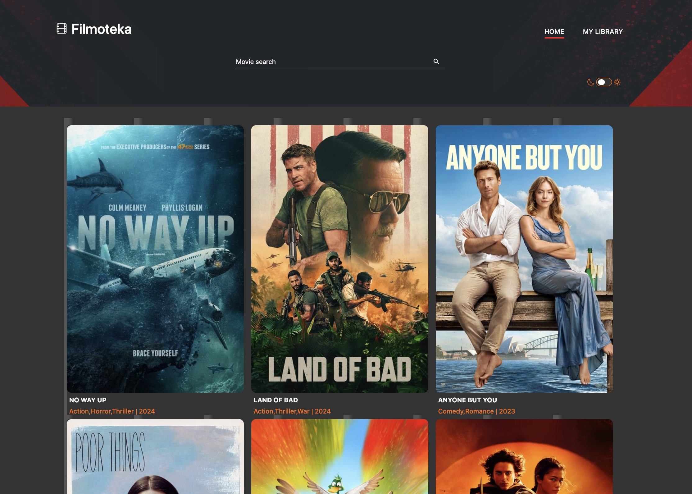
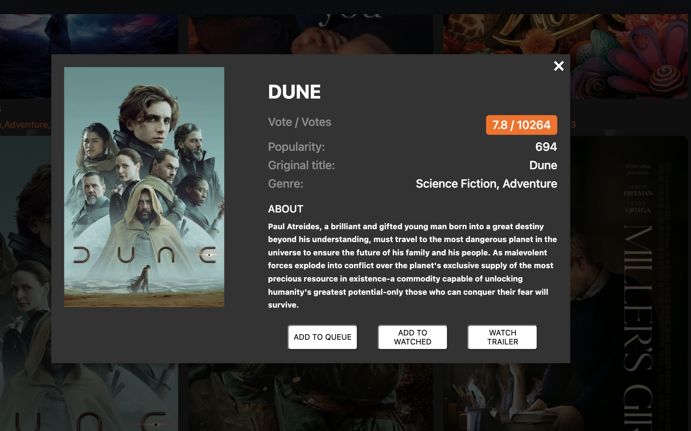
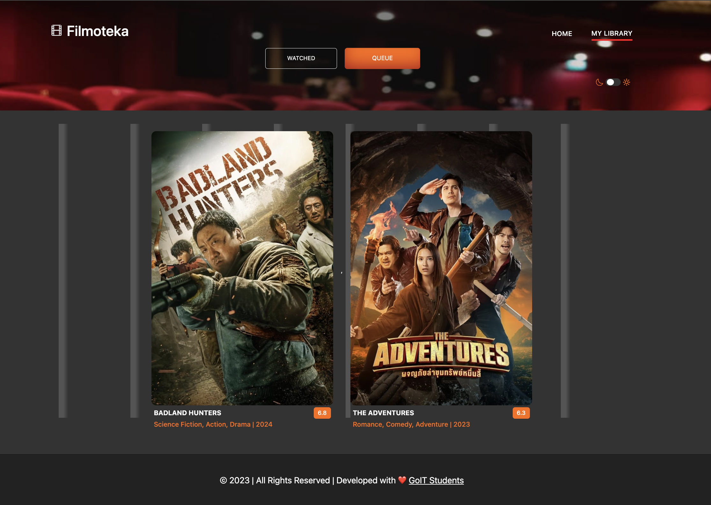

# Project "Filmoteka"

The "Filmoteka" project is a web application for browsing and managing a collection of movies. It was built using HTML, CSS, and JavaScript technologies.

## Description

The application allows users to search a movie database, add them to a "Watch Later" or "Watched" list, and use a modal window where they can find movie descriptions and options to add them to the queue or the watched list.

## Gallery

### 1. Main page with movie gallery

### 2. Modal window with movie description and functionalities

### 3. "Watched" tab

## Technologies Used

- HTML
- CSS
- JavaScript
- GIT
- FIGMA
- API : "the Movie Database TMDB"